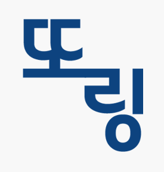

<h2>한양대학교 소프트웨어 융합 캡스톤디자인2 - 1조</h2>
 

## 프로젝트
<ul>
  <li>SpringFramework를 이용한 한양대학교 튜터링 매칭 웹페이지</li>
  <li>캡스톤 디자인2 경진대회 출품</li>
  <li>3인 팀프로젝트</li>
</ul> 
 
## 프로젝트 기간
2020.03~2020.06

## 프로젝트 개요
 
&nbsp;<h3>1. 기획의도</h3>

프로젝트 명은 "또링"으로써 “또링”의 의미는 저희 학교의 튜터링 시스템 이름인 “또래 튜터링”의 줄임말과 동시에 “또 링크하자”라는 의미를 담고 있습니다. 저희가 기존의 한양대학교 튜터링 시스템이 있는 데도 불구하고 새로운 튜터링 서비스를 만들게 된 선정동기는 다음과 같습니다.  
1. 다중전공과 융합전공의 학습 적응도 향상입니다. 튜터링의 주 수요층인 다중/융합 전공자들이 느낄 주전공과의 간극을 해결하여 진정한 다중/융합 전공의 목표에 기여할 수 있을 것이라고 봤기 떄문입니다. 
 
2. 비교과 튜터링 활성화입니다. 전공과목 외에도 비전공 분야의 튜터링을 활성화하여, 튜터의 다른 재능 및 능력이 활용되고 튜티의 잠재력 발전에 기여할 수 있을 것입니다. 
 
 
 &nbsp;<h3>2. 동기와 배경</h3>

1. 다중/융합전공 학생들의 튜터링 기회가 주전공 학생들에 비해서 매우 적습니다. 그 이유는 또래 튜터링은 또래 튜터링 팀원들이 대부분 학과 선후배로 구성이 되어 있는 경우가 많기 때문입니다. 
   
2. 검증이 안된 튜터링 서비스가 대부분 신뢰성이 낮습니다. 현재 많은 학생들은 튜터링 구인 수단으로 SNS를 많이 활용하고 있습니다. 하지만 이 방법은 대부분 익명으로 이루어지고 튜터 또는 튜티가 튜터링을 진행할 수 있는 여건이나 역량이 되는 지에 대에 검증이 되지 않은 경우가 많습니다. 따라서 이 문제 상황들을 해결하기 위해서는 과목 및 튜터, 튜티의 다양성을 확대하는 것이 필요하고 SNS서비스들이 가진 문제를 해결하기 위해 투명하고 검증된 시스템이 필요로 합니다.
 
&nbsp;<h3>3. 기대효과</h3>

학생들은 자유로운 양방향 튜터링 매칭과정을 통해 전보다 더 많은 경험과 지식 축적이 가능하고 학교는 학생들의 자발적이고 적극적인 참여를 통해 인재를 양성할 수 있습니다.
또한 커뮤니티 기능을 통해 현재 보고서 제출 절차의 불편함을 해소하고 튜터 및 튜티에 대한 신뢰성 데이터를 확보할 수 있습니다. 
궁극적으로 우리의 시스템을 통해 우리 학교 학생들의 역량을 높일 수 있는 기대효과가 있습니다.
  
&nbsp;<h3>4. 차별점</h3>

다른 대학교의 유사사례들과 다르며, 기존의 한양 튜터링 시스템에 없는 새로운 한양 또래튜터링 서비스 “또링”이 가지게 될 차별점은 다음과 같습니다.  첫 번째로 역경매 시스템입니다. 또링은 팀 구성에 있어서 쌍방 접근이 가능하며,튜터와 튜티간의 양방향 매칭이 가능한 서비스를 구현할 예정입니다. 이를 바탕으로 튜티 또한 튜터를 구할 수 있고 튜터도 튜티를 구할 수 있는 시스템이 완성될 것입니다. 한 비교과, 다중/융합 전공생들의 접근성을 증가시킬 수 있습니다. 두 번째 차별점은 입체적인 커뮤니티 공간입니다. 커뮤니티를 통해 실시간 자료 공유가 가능하고, 개인 포트폴리오 자료 정리도 가능할 것입니다.

## 주요 기능
<ul>
  <li>로그인/회원가입/로그아웃 기능</li>
  <li>회원정보 수정</li>
  <li>커뮤니티(게시판, 댓글) 운</li>
  <li>댓글을 통한 매칭시스템</li>
</ul>

## 사용기술
<ul>
  <li>Apache Tomcat 9.0</li>
  <li> SpringFramework</li>
  <li> Mybatis</li>
  <li> Maven</li>
</ul>

## 사용언어
<ul>
  <li>Java</li>
  <li>Oracle SQL</li>
  <li>HTML, CSS, Javascript</li>
</ul>

